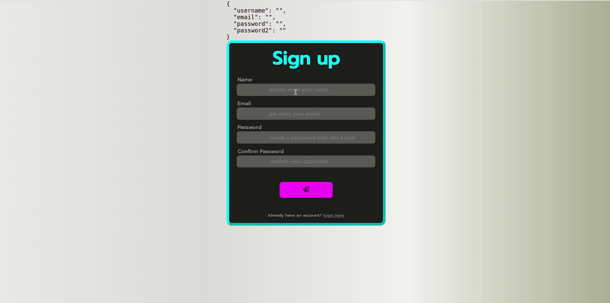
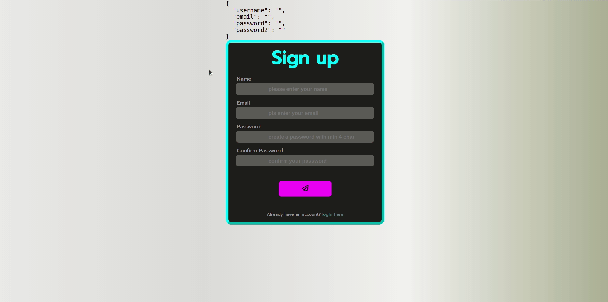
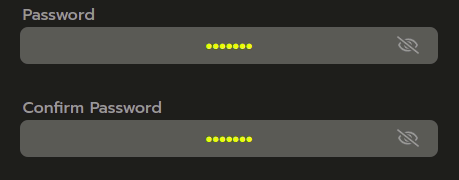

# Create a SignUp form:

---

## :cartwheeling: Exercise

- Split your app up into components.
- Create the SignUp Form
- To manage your state use the `useState` Hook from React.
- After the user signed up, show the welcome page.
- Add your preferred styling.

As a guidline, how the finished product could be looking, use the picture as a refernce.

---
## :weight_lifting: Bonus - add validation

:mag_right: **suggestions for your validation**

- Check if all field have entries.
- Check if email contains @ sign etc. 
- Check if password has min char, incl. numbers etc.
- Check if both passwords do match.

## :weight_lifting::weight_lifting::bomb: Xtra Bonus :rocket: add a password visibility toggler

- the icon and password visibility should be toggled when clicked

---

