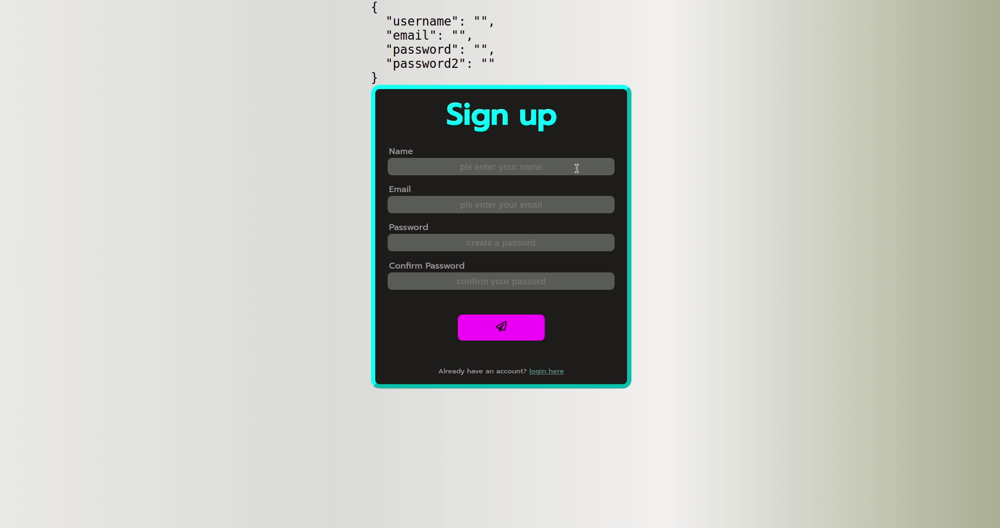

# Create a SignUp form:

---

As a guidline, how the finished product could be looking, use the picture as a refernce. 

---

## :cartwheeling: Exercise

- Split your app up into components.
- Create the SignUp Form
- To manage your state use the `useState` Hook from React.
- After the user signed up, show the welcome page.

---
## :weight_lifting: Bonus

- Add validation for all the fields

